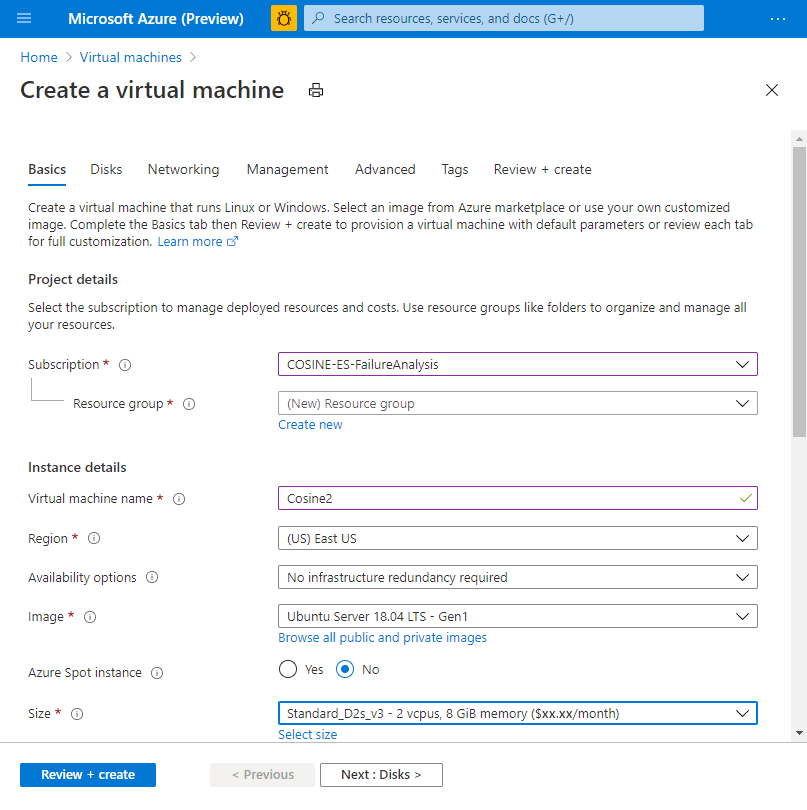
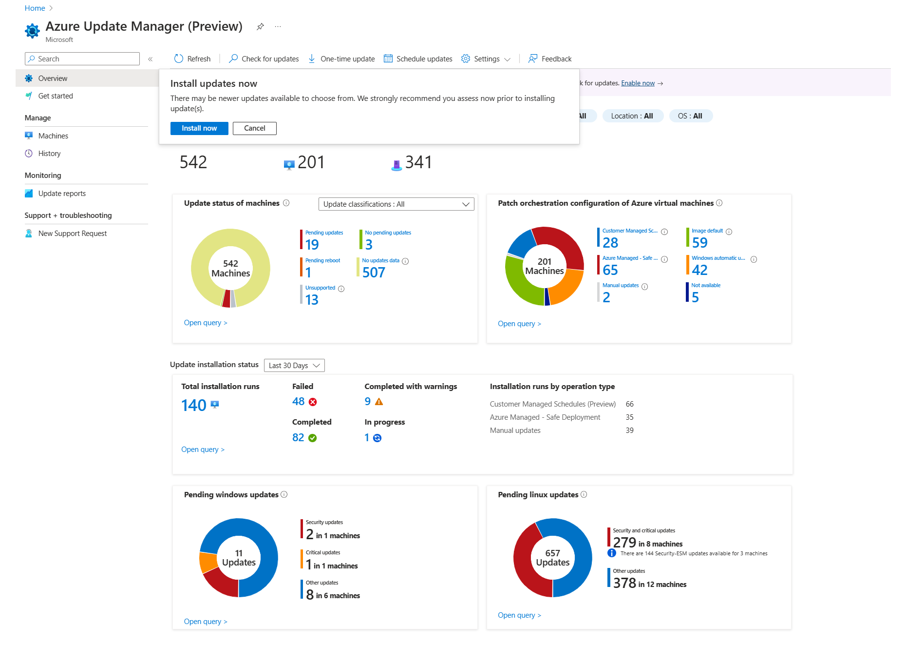

##  Azure Virtual Machines – Guia Didático e Completo

###  1. Conceitos Fundamentais

####  O que são Máquinas Virtuais (VMs)?

São computadores virtuais baseados na nuvem que emulam um servidor físico. Você escolhe:

- Sistema operacional (Windows ou Linux).
- Configuração de hardware (CPU, memória, disco).
- Rede e segurança.

Elas são parte do modelo IaaS (Infrastructure as a Service), em que a Microsoft gerencia a infraestrutura física (datacenters) e você gerencia o sistema operacional, apps e dados.

####  Principais termos e seus significados

### SKU / Size**

Define a potência da VM. Inclui:

- Quantidade de vCPUs (núcleos virtuais de processamento).
- Quantidade de memória RAM.
- Tipo e número de discos suportados.
- Capacidade de rede (largura de banda).

Exemplo prático:

- Standard_B2ms → 2 vCPUs, 8 GB RAM → bom para aplicações leves ou laboratório.
- D-Series → produção geral, bancos de dados pequenos/médios.
- E-Series → otimizadas para memória, ideais para bancos de dados ou analytics.
- F-Series → alto processamento com menor memória (compute optimized).

### Imagem (Image)

É o sistema operacional + versão que será instalado na VM. Pode ser:

- Imagens do Marketplace (Windows Server, Ubuntu, Red Hat, etc).
- Imagens personalizadas que você cria com configurações pré-definidas para padronizar deploys.

## Discos Gerenciados

São discos virtuais gerenciados pelo Azure para alta disponibilidade, criptografia automática e resiliência. Tipos comuns:

- Premium SSD → alto desempenho, recomendado para produção.
- Standard SSD → melhor custo-benefício para cargas moderadas.
- Standard HDD → menor custo, performance básica (evite para produção).

## NIC (Network Interface Card)

Interface de rede virtual que conecta a VM à sua VNet (rede virtual do Azure). Cada VM precisa de pelo menos uma NIC para se comunicar.

## NSG (Network Security Group)

Funciona como um firewall que controla tráfego de entrada e saída com regras baseadas em:

- Porta (ex: 3389 para RDP, 22 para SSH).
- Protocolo (TCP/UDP).
- Origem e destino do tráfego.

###  2. Processos técnicos explicados

####  Como criar uma VM no Azure Portal (passo a passo detalhado)

1.  Login no Azure Portal
    `https://portal.azure.com`
2.  Navegue até Virtual Machines no menu lateral ou pesquise na barra superior.
3.  Clique em Create > Virtual Machine.
4.  Preencha as informações básicas:
    a.  Subscription → sua assinatura Azure.
    b.  Resource Group → agrupa recursos relacionados (ex: rg-lab-vms).
    c.  Virtual Machine name → nome único dentro do resource group.
    d.  Region → escolha a região mais próxima do usuário para menor latência (ex: Brazil South).
5.  Escolha a imagem (Image)
    Ex: Windows Server 2022 Datacenter ou Ubuntu 22.04 LTS.
6.  Selecionar Size (SKU)
    Escolha de acordo com o workload (Standard_B2ms para labs é suficiente).
7.  Autenticação
    a.  Windows → username + senha complexa.
    b.  Linux → chave SSH (mais seguro) ou senha.
8.  Opções de Disco
    a.  OS Disk Type: Standard SSD ou Premium SSD.
    b.  Opção de encryption habilitada por padrão.
9.  Configuração de rede
    a.  Virtual Network (VNet) → define onde a VM ficará conectada.
    b.  Subnet → segmenta redes para organização e segurança.
    c.  Public IP → cria IP público se você quiser acesso direto externo (evitar em produção sem jumpbox ou bastion).
    d.  NSG → configure portas de acesso (ex: 3389 para RDP Windows).
10. Revisar e Criar
    O Azure valida as configurações e inicia o provisionamento em minutos.

####  Gerenciamento de VM após criação

## Start / Stop / Restart

- Start: liga a VM.
- Stop: desliga a VM, mas continua cobrando o disco e IP público.
- Stop (deallocated): desliga e libera recursos de computação (não cobra CPU/RAM, apenas armazenamento).

## Auto-shutdown

Configura desligamento automático em horários pré-definidos (ex: 19:00). Excelente para laboratórios ou ambientes de desenvolvimento, reduzindo custos.

## Monitoramento

- Azure Monitor → métricas como CPU, disco, memória.
- Log Analytics → logs detalhados, diagnóstico avançado e queries KQL para insights.

## Backups

- Configure Recovery Services Vault para snapshots programados e recuperação de desastres. Essencial em produção.

## Extensions

São pacotes que adicionam funcionalidades na VM, como:

- Agente do Azure Monitor.
- Extensão de antivírus (Microsoft Antimalware).
- Scripts customizados para configuração pós-deploy.

###  3. Anotações importantes (com exemplos práticos)

## Scale Sets

Cria múltiplas instâncias idênticas de uma VM, permitindo escalar automaticamente com base na demanda (ex: aumento de usuários em um sistema web).

## Availability Sets e Availability Zones

- Availability Sets: garante que VMs fiquem em racks físicos diferentes no mesmo datacenter → reduz impacto de falhas de hardware.
- Availability Zones: distribui VMs em diferentes zonas físicas dentro da região → alta disponibilidade contra falhas de datacenter inteiro.

## Naming Convention recomendada

Seguir padrão para organização e automação:
`vm-[funcao]-[ambiente]-[regiao]-[sequencia]`
Ex: `vm-app-prd-brazil-01`

## Tags

Adicione tags para:

- Owner: quem é responsável.
- Environment: dev, test, prod.
- CostCenter: centro de custo ou projeto.

## Snapshots vs Backup

- Snapshot: cria cópia do disco em ponto no tempo (rápido para labs ou dev).
- Backup: solução completa, inclui agendamento, retenção e restauração integrada (essencial em produção).

###  4. Dicas práticas para otimização

## Reduza custos

- Desligue VMs quando não usadas (Stop-Deallocate).
- Use Reserved Instances para workloads previsíveis, economizando até 72%.

## Segurança

- Evite IP público direto em produção; utilize Azure Bastion ou jumpbox.
- Configure Just-in-Time VM Access no Defender for Cloud para expor portas apenas quando necessário.

## Automatização

- Use ARM Templates, Bicep ou Terraform para padronizar deploys e reduzir erros manuais.
- Scripts CLI ajudam em deploys rápidos de laboratórios e provas.

## Governança

- Crie Azure Policies para restringir:
    - Tipos e tamanhos de VM permitidos.
    - Regiões onde recursos podem ser criados.
    - Obrigatoriedade de tags.

###  Resumo final didático

 Máquinas Virtuais no Azure permitem:

- Rodar aplicações legadas na nuvem.
- Criar laboratórios de estudo e ambientes de desenvolvimento.
- Implementar workloads de produção com segurança, alta disponibilidade e governança.

Segue a implementação completa da tarefa em PowerShell, Azure CLI e ARM Template, conforme seus requisitos:

###  Cenário

✅ VM: Windows Server 2022
✅ Resource Group: rg-dev-vm
✅ Região: Brazil South
✅ Nome da VM: vm-dev-01
✅ Tamanho: Standard_B2ms
✅ VNet: vnet-dev (10.1.0.0/16)
✅ Subnet: subnet-dev (10.1.1.0/24)
✅ IP Público: Dinâmico
✅ NSG: Permitir RDP (3389) apenas do seu IP público


###  1. PowerShell

```powershell
# Conectar ao Azure
Connect-AzAccount
# Variáveis
$resourceGroup = "rg-dev-vm"
$location = "brazilsouth"
$vnetName = "vnet-dev"
$vnetAddress = "10.1.0.0/16"
$subnetName = "subnet-dev"
$subnetAddress = "10.1.1.0/24"
$vmName = "vm-dev-01"
$vmSize = "Standard_B2ms"
$adminUser = "azureuser"
$adminPassword = ConvertTo-SecureString "SenhaComplexa@123" -AsPlainText -Force
$publicIPName = "$vmName-pip"
$nsgName = "$vmName-nsg"
$nicName = "$vmName-nic"
# Seu IP público
$myIP = (Invoke-RestMethod -Uri "http://ifconfig.me/ip")
# Criar Resource Group
New-AzResourceGroup -Name $resourceGroup -Location $location
# Criar VNet e Subnet
$vnet = New-AzVirtualNetwork -ResourceGroupName $resourceGroup -Location $location `
-Name $vnetName -AddressPrefix $vnetAddress
Add-AzVirtualNetworkSubnetConfig -Name $subnetName -VirtualNetwork $vnet -AddressPrefix $subnetAddress
$vnet | Set-AzVirtualNetwork
# Criar Public IP
$pip = New-AzPublicIpAddress -ResourceGroupName $resourceGroup -Name $publicIPName -Location $location -AllocationMethod Dynamic
# Criar NSG
$nsg = New-AzNetworkSecurityGroup -ResourceGroupName $resourceGroup -Location $location -Name $nsgName
# Criar regra de RDP apenas para seu IP
$nsgRuleRDP = New-AzNetworkSecurityRuleConfig -Name "Allow-RDP-MyIP" -Protocol "Tcp" -Direction "Inbound" -Priority 1000 -SourceAddressPrefix $myIP `
-SourcePortRange "*" -DestinationAddressPrefix "*" -DestinationPortRange 3389 -Access "Allow"
$nsg | Add-AzNetworkSecurityRuleConfig -Name $nsgRuleRDP.Name -SecurityRule $nsgRuleRDP | Set-AzNetworkSecurityGroup
# Criar NIC
$subnet = Get-AzVirtualNetworkSubnetConfig -VirtualNetwork $vnet -Name $subnetName
$nic = New-AzNetworkInterface -ResourceGroupName $resourceGroup -Location $location -Name $nicName -SubnetId $subnet.Id -PublicIpAddressId $pip.Id -NetworkSecurityGroupId $nsg.Id
# Criar VM
$cred = New-Object System.Management.Automation.PSCredential ($adminUser, $adminPassword)
$vmConfig = New-AzVMConfig -VMName $vmName -VMSize $vmSize |
Set-AzVMOperatingSystem -Windows -ComputerName $vmName -Credential $cred -ProvisionVMAgent -EnableAutoUpdate |
Set-AzVMSourceImage -PublisherName "MicrosoftWindowsServer" -Offer "WindowsServer" -Skus "2022-Datacenter" -Version "latest" |
Add-AzVMNetworkInterface -Id $nic.Id
New-AzVM -ResourceGroupName $resourceGroup -Location $location -VM $vmConfig
```


###  2. Azure CLI

```bash
# Login
az login
# Variáveis
resourceGroup="rg-dev-vm"
location="brazilsouth"
vnetName="vnet-dev"
vnetAddress="10.1.0.0/16"
subnetName="subnet-dev"
subnetAddress="10.1.1.0/24"
vmName="vm-dev-01"
vmSize="Standard_B2ms"
adminUser="azureuser"
adminPassword="SenhaComplexa@123"
publicIPName="$vmName-pip"
nsgName="$vmName-nsg"
nicName="$vmName-nic"
# Seu IP público
myIP=$(curl -s ifconfig.me)
# Criar Resource Group
az group create --name $resourceGroup --location $location
# Criar VNet e Subnet
az network vnet create \
--resource-group $resourceGroup \
--name $vnetName \
--address-prefix $vnetAddress \
--subnet-name $subnetName \
--subnet-prefix $subnetAddress
# Criar IP Público
az network public-ip create \
--resource-group $resourceGroup \
--name $publicIPName \
--allocation-method Dynamic
# Criar NSG
az network nsg create \
--resource-group $resourceGroup \
--name $nsgName
# Criar regra RDP apenas para seu IP
az network nsg rule create \
--resource-group $resourceGroup \
--nsg-name $nsgName \
--name Allow-RDP-MyIP \
--protocol Tcp \
--direction Inbound \
--priority 1000 \
--source-address-prefixes $myIP \
--source-port-ranges \'*\' \
--destination-address-prefixes \'*\' \
--destination-port-ranges 3389 \
--access Allow
# Criar NIC
subnetId=$(az network vnet subnet show --resource-group $resourceGroup --vnet-name $vnetName --name $subnetName --query id -o tsv)
pipId=$(az network public-ip show --resource-group $resourceGroup --name $publicIPName --query id -o tsv)
nsgId=$(az network nsg show --resource-group $resourceGroup --name $nsgName --query id -o tsv)
az network nic create \
--resource-group $resourceGroup \
--name $nicName \
--subnet $subnetId \
--public-ip-address $pipId \
--network-security-group $nsgId
# Criar VM
az vm create \
--resource-group $resourceGroup \
--name $vmName \
--nics $nicName \
--image Win2022Datacenter \
--size $vmSize \
--admin-username $adminUser \
--admin-password $adminPassword \
--location $location \
--output json
```


###  3. ARM Template

Segue um modelo resumido com as funcionalidades requisitadas.

####  azuredeploy.json

```json
{
"$schema": "https://schema.management.azure.com/schemas/2019-04-01/deploymentTemplate.json#",
"contentVersion": "1.0.0.0",
"parameters": {
"adminUsername": {
"type": "string",
"defaultValue": "azureuser"
},
"adminPassword": {
"type": "securestring"
},
"myIP": {
"type": "string",
"metadata": {
"description": "Seu IP público para liberar RDP"
}
}
},
"resources": [
{
"type": "Microsoft.Network/virtualNetworks",
"apiVersion": "2022-09-01",
"name": "vnet-dev",
"location": "brazilsouth",
"properties": {
"addressSpace": {
"addressPrefixes": ["10.1.0.0/16"]
},
"subnets": [
{
"name": "subnet-dev",
"properties": {
"addressPrefix": "10.1.1.0/24"
}
}
]
}
},
{
"type": "Microsoft.Network/networkSecurityGroups",
"apiVersion": "2022-09-01",
"name": "vm-dev-01-nsg",
"location": "brazilsouth",
"properties": {
"securityRules": [
{
"name": "Allow-RDP-MyIP",
"properties": {
"protocol": "Tcp",
"sourcePortRange": "*",
"destinationPortRange": "3389",
"sourceAddressPrefix": "[parameters(\'myIP\')]",
"destinationAddressPrefix": "*",
"access": "Allow",
"priority": 1000,
"direction": "Inbound"
}
}
]
}
},
{
"type": "Microsoft.Network/publicIPAddresses",
"apiVersion": "2022-09-01",
"name": "vm-dev-01-pip",
"location": "brazilsouth",
"properties": {
"publicIPAllocationMethod": "Dynamic"
}
},
{
"type": "Microsoft.Network/networkInterfaces",
"apiVersion": "2022-09-01",
"name": "vm-dev-01-nic",
"location": "brazilsouth",
"dependsOn": [
"vnet-dev",
"vm-dev-01-pip",
"vm-dev-01-nsg"
],
"properties": {
"ipConfigurations": [
{
"name": "ipconfig1",
"properties": {
"subnet": {
"id": "[resourceId(\'Microsoft.Network/virtualNetworks/subnets\',\'vnet-dev\',\'subnet-dev\')]"
},
"privateIPAllocationMethod": "Dynamic",
"publicIPAddress": {
"id": "[resourceId(\'Microsoft.Network/publicIPAddresses\',\'vm-dev-01-pip\')]"
}
}
}
],
"networkSecurityGroup": {
"id": "[resourceId(\'Microsoft.Network/networkSecurityGroups\',\'vm-dev-01-nsg\')]"
}
}
},
{
"type": "Microsoft.Compute/virtualMachines",
"apiVersion": "2022-11-01",
"name": "vm-dev-01",
"location": "brazilsouth",
"dependsOn": ["vm-dev-01-nic"],
"properties": {
"hardwareProfile": {
"vmSize": "Standard_B2ms"
},
"storageProfile": {
"imageReference": {
"publisher": "MicrosoftWindowsServer",
"offer": "WindowsServer",
"sku": "2022-Datacenter",
"version": "latest"
},
"osDisk": {
"createOption": "FromImage"
}
},
"osProfile": {
"computerName": "vm-dev-01",
"adminUsername": "[parameters(\'adminUsername\')]",
"adminPassword": "[parameters(\'adminPassword\')]"
},
"networkProfile": {
"networkInterfaces": [
{
"id": "[resourceId(\'Microsoft.Network/networkInterfaces\',\'vm-dev-01-nic\')]"
}
]
}
}
}
]
}
```


### Imagens de Referência

- **Criação de VM no Portal Azure:**
  - 
- **Configuração de VM no Portal Azure:**
  - 
- **Resultados de Deploy de VM no Azure:**
  - 


